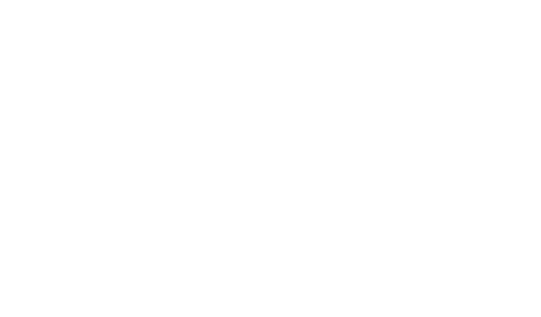

<div align="center">
  

  # LFH - Liga de Futevôlei de Hortolândia 🏐🏆

  **A revolução da areia começou.** Mais que um circuito, uma plataforma digital completa desenhada para elevar o nível do futevôlei na região, conectando atletas com rankings ao vivo, transparência estatística e etapas eletrizantes.

  🌐 **[ligafutevoleihortolandia.com.br](https://ligafutevoleihortolandia.com.br) | [Status do Projeto: Ativo & Hospedado 🚀]**
</div>

---

## 🛠️ Stack Tecnológico


O projeto bebe da fonte das tecnologias mais modernas para entregar máxima performance (Load time reduzido), fluidez visual (animações a 60fps) e integridade dos dados sob forte aderência ao SQL.

---

## ✨ Funcionalidades Principais

* 🌌 **Landing Page Imersiva:** Design moderno focado na paleta de cores *Preto Galáctico*, *Branco Off-White* e *Dourado Metálico*, impulsionado por efeitos *glassmorphism* e micro-interações usando a lib Framer Motion.
* 📝 **Sistema de Inscrição Inteligente (Multietapas):** Fluxo para check-in de atletas garantindo a integridade dos dados antes deles tocarem no banco de dados. Conta com máscaras dinâmicas e validação formal de **CPF**, além da coleta e padronização do E-mail e WhatsApp para os times organizadores.
* 🔐 **Dashboard Admin Protegido:** Painel com integração de ponta-a-ponta permitindo a auditoria de inscrições e verificação de informações sensíveis restritas. Todo controle do evento e mudança de "Status de Pagamento" a um botão de distância.
* 📈 **Ranking Anual em Tempo Real:** Visões front-end automatizadas e categorizadas que calculam os resultados agregados sem onerar o JavaScript, delegando o cálculo pesado matematicamente para as Views SQL rodando direto no servidor.

---

## 🏗️ Arquitetura e Infraestrutura

A confiabilidade não mora apenas no visual impactante, mas debaixo do capô. A LFH tira proveito de conceitos robustos de infraestrutura Serverless e Edge Computing:

* **☁️ BaaS Dinâmico (Supabase)**: O núcleo de armazenamento. Contém *Webhooks* programados e reforços de segurança rígidos implementados diretamente nas tabelas através da arquitetura de *Row Level Security (RLS)*.
* **🔥 Distribuição Global (Firebase Hosting)**: Todo o bundle React construído via Vite é despachado utilizando as rotas em cache super rápidas e alta disponibilidade do Firebase do Google.
* **✉️ Automação Lógica (Edge Functions)**: Transações corporativas complexas (como o envio autônomo do E-mail de confirmação pelo gateway da **Resend API**) são delegadas sem causar delays no usuário, acionando de forma assíncrona o Edge Server com Deno Typescript sempre que uma nova inserção passa pela porta principal do banco.

---

## 🧠 Destaque Técnico: Integridade de Dados no Ranking

Para eventos de areia de alta competitividade, o cálculo do Circuito é imperdoável: os pontos de um ano inteiro pertencem unicamente a **mesma e exata parceria de dois CPFs**. 

A arquitetura de backend deste projeto foi pensada para blindar os organizadores contra redundâncias manuais ou erros de checagem. Apresentamos a **Lógica de Dupla Única**:  
Toda pontuação gerada não é atrelada diretamente a um Atleta, mas sim a um **"Entity ID" (Dupla)**.

Para confirmar o ID, não existem registros fantasma ou espelhados. Se o `Atleta A` tentar se registrar com o `Atleta B`, a combinação no banco deve se mesclar imediatamente como um só, inviabilizando outra entrada com a ordem revertida (`B` com `A`).

```sql
-- Regra matemática nas Constrains que converte qualquer permutação da dupla num único Vector/Relation
CONSTRAINT unique_dupla UNIQUE (atleta_1_id, atleta_2_id),
CONSTRAINT check_atleta_ordem CHECK (atleta_1_id < atleta_2_id)
```

No ecossistema do React em TSX, a aplicação resolve esse quebra-cabeça na submissão em tempo real ordenando as chaves primárias dos recém-cadastrados numericamente de forma decrescente:

```tsx
const ids = [atleta1Data.id, atleta2Data.id].sort();
// Envia silenciosamente o payload exato esperado pela constraint do bd
```
Ao final do dia, a Liga ganha um Ranking limpo, blindado a fraudes e redundâncias perfeitamente rastreável!

---

<div align="center">
  <p>Feito com paixão pela inovação na tecnologia. Desenvolvido para a elite do futevôlei. 🏐🌊🏆</p>
</div>
